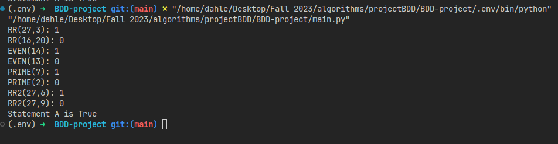

# My BDD Project for CS 350

## Project Overview
Construct several BDDs using the pydea python library to learn about storing large graphs in memory.

## Project Setup
I use a virtual environment using python 3.7 (for pyeda compatibility), the pyeda library, and the graphviz library for BDD visualization

## File Structure
- my_functions.py: just some helper functions
- main.py: where all the stuff gets done

## Screenshot of Results

## Project Outline
- Define the BDD variables needed
- Define the sets for the even, prime, and edges
- Get the BDDs for those sets
- Test the BBDs for the even, prime and edge sets
- Compute RR2
- Test the BDD for RR2
- Compute RRstar for RR2
- Compute the answer for Statement A

